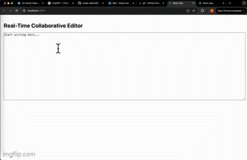

#  Real-Time Collaborative Text Editor

A **Google Docs-style** collaborative editor where multiple users can edit a document **in real-time**.

Built with **React**, **Node.js**, **Socket.IO**, and **Express**.

---

##  Demo

 <!-- Replace with your own GIF or image -->

---

##  Features

-  **Real-Time Editing** – Multiple users can type simultaneously.
-  **WebSocket Communication** – Powered by Socket.IO for live updates.
-  **Document Synchronization** – All clients stay perfectly in sync.
-  **Fast & Lightweight** – Built for speed using React & Express.

---

##  Tech Stack

- **Frontend**: React, Socket.IO Client
- **Backend**: Node.js, Express, Socket.IO
- **Real-Time**: WebSocket protocol (with fallback to Polling if needed)

---

##  Project Structure

```
/collab-editor
├── /backend
│   └── server.js          # Express + Socket.IO server
│
├── /frontend
│   ├── src
│   │   └── App.js         # React client with real-time sync
│   └── package.json
```

---

##  Setup Instructions

### 1. Clone the Repository
```bash
git clone https://github.com/YOUR_USERNAME/collab-editor.git
cd collab-editor
```

### 2. Install Backend Dependencies
```bash
cd backend
npm install
node server.js
```

### 3. Install Frontend Dependencies
```bash
cd ../frontend
npm install
npm start
```

### 4. Open in Browser
- Visit **http://localhost:3000**
- Open two tabs to see **real-time sync** in action!

---

##  Next Features (In Progress)

- [ ] Rich Text Editing with **Quill.js**.
- [ ] **User Authentication** – Login & manage your documents.
- [ ] **Version History** – Track changes and restore previous versions.
- [ ] **Deployment** – Live version coming soon.

---

##  What I Learned

- How to implement **real-time communication** using WebSockets.
- Managing **frontend-backend synchronization**.
- Debugging complex **connection issues** in a dev environment.
- Handling **React Fast Refresh** and persistent WebSocket connections.

---

##  Contact

Have questions? Reach out!

- **GitHub**: github.com/danv27
- **Email**: vdanny911@gmail.com

---

## ⭐️ Show Your Support

If you liked this project, give it a ⭐ on [GitHub](https://github.com/YOUR_USERNAME/collab-editor) — it helps!

---
